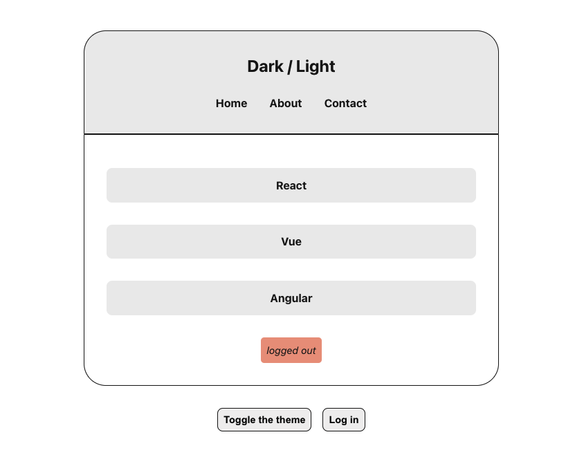

# 1. Carousel - basic
## Features
- Fully responsive
- Navigate using left, right buttons
    - opacity reduced at either ends
- Navigate using indicators(dots)
- Navigation using mouse and/or touch gestures

## Skills
- HTML
- CSS
- JavaScript

## Screenshots

